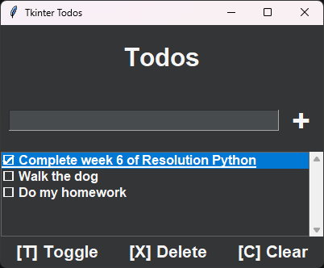

# Tkinter Todos

This is a simple Todo app made with Tkinter in Python. Note that styling has only been tested on Windows.

## Usage

## Keyboard Shortcuts

Esc - Exit  
Enter - Add a task  
Tab - Cycle Focus  
A - Focus the add task entry  
T - Toggle the completion of the selected task  
X - Delete the selected task  
C - Clear Tasks